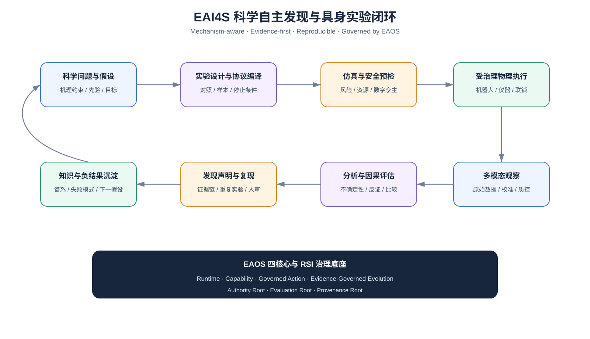
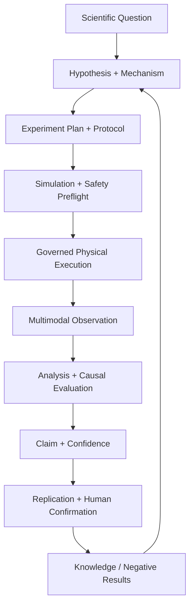

# EAI4S — AI & Embodied Intelligence for Science

> Status: **Concept / Discussion Draft — No Code Development**  
> Date: 2026-09-12  
> Track: **D — Scientific Discovery Reference Domain**  
> Architecture Authority: AgentOSArchitect / XADR-010

## Mission

EAI4S 面向科学自主发现与自主实验，建立从科学问题到物理实验验证的完整闭环：

```text
Scientific Question → Hypothesis / Mechanism → Experiment Design
→ Protocol Compilation → Simulation / Safety Preflight
→ Physical Experiment Execution → Multimodal Observation
→ Analysis / Causal Evaluation → Discovery Claim
→ Replication / Human Confirmation → Knowledge / Next Hypothesis
```

EAI4S 借鉴 Discovery Loop 的“自动化完整实验循环、并行实验与可测结果”方向，但不把目标限制在计算实验或模型优化。其差异化重点是：

```text
AI reasoning + embodied experiment execution
mechanism/causal constraints + data-driven search
positive and negative result learning
raw evidence + reproducibility + lineage
digital twin / simulation before risky physical execution
EAOS-governed authority, interruption, recovery and rollback
RSI-driven improvement without self-authorized production changes
```

## Program Position

EAI4S 是第四条验证轨，不是第五个 EAOS Core，也不是 physAgentOS 的分叉。

| Track | Repository | Ownership |
|---|---|---|
| A | physAgentOS | Stable Runtime / Contract / Governance |
| B | SilverMind / virtual_idol | Human relationship and companion reference domain |
| C | eaos-vlatest | Experimental VLA / ActionProducer evidence |
| D | EAI4S | Scientific discovery loop reference domain; concept-only initially |

EAOS 仍为四核心：

```text
Agent Runtime Core
Capability Composition Core
Governed Action Core
Evidence-Governed Evolution Core
```

EAI4S 通过这些核心编排科学任务、实验设备、机器人、数据、模型与验证器，但不复制 Runtime、World、Device、Evidence、Policy、Lease、Approval 或 Evolution authority。



## Scientific Discovery Loop



闭环完成必须具备协议、样本/试剂/仪器谱系，环境与校准状态，原始观察证据，分析代码/模型版本，接受或证伪标准，不确定性与异常记录，复现状态及发现声明的人类确认。

## Domain Architecture

### Scientific Cognition Plane

拥有 `ScientificQuestion`、`Hypothesis`、`MechanismConstraint`、`PriorKnowledge`、`ExperimentObjective`、`MultiObjectivePreference`、`DiscoveryClaim`。必须区分先验、假设、观察、推断和已确认结论。

### Experiment Design and Compilation Plane

拥有 `ExperimentalProtocol`、`ProcedureStep`、`Material/Sample/Batch`、`ReagentConstraint`、`MeasurementPlan`、`ControlGroup`、`ReplicationPlan`、`StoppingCriterion`。协议编译器把科学意图映射为 EAOS TaskGraph、能力需求与受治理 ActionProposal，但不能绕过 Policy、Approval、Lease 或设备安全约束。

### Embodied Experiment Plane

通过 EAOS 纳管机械臂、移动操作机器人、液体工作站、合成设备、光谱/显微/成像仪器、环境控制、传感器及样品流转设备。硬实时控制保留在设备控制器中，LLM/VLM/VLA 不进入伺服闭环。

### Observation and Scientific Evidence Plane

`ScientificObservation` 包含原始仪器输出、图像/视频/光谱/波形、样本谱系、时钟/校准、质控标志、缺失/失败/异常记录和派生分析产品。负结果与不确定结果是一等证据，不因降低分数而被删除。

### Discovery Evaluation and Evolution Plane

Evolution Core 可以生成实验计划、工作流、分析或模型候选，统一遵循：

```text
Evidence → ImprovementObjective → Immutable Candidate
→ Sandbox / Replay → Independent Evaluation → SafetyCase
→ Shadow / Bounded Canary → Governed Promotion or Rollback
```

候选不能改写评判自身的 Authority、Evaluation 或 Provenance roots。

## Agent Roles

| Role | Responsibility | No Authority To |
|---|---|---|
| Scientist Principal | defines question, constraints and approval scope | bypass safety or provenance |
| Scientific Orchestrator | coordinates discovery loop | declare truth without verifier |
| Hypothesis Agent | proposes competing hypotheses | suppress negative evidence |
| Protocol Agent | compiles experimental protocol | directly actuate devices |
| Embodied Experiment Agent | executes approved plan through EAOS | change protocol outside lease |
| Observation Agent | captures and quality-checks evidence | rewrite raw data |
| Analysis / Verifier Agent | evaluates outcomes and uncertainty | modify acceptance criteria mid-run |
| Safety Steward | reviews hazards and stop conditions | optimize scientific score |
| Knowledge Curator | commits confirmed/qualified knowledge | erase lineage or failed trials |

角色隔离必须落实为独立 principal/evaluator context，不能只依赖 Prompt 描述。

## Key Objects

```text
ScientificQuestion / Hypothesis / MechanismConstraint
ExperimentObjective / ExperimentalProtocol / ProtocolCompilation
ExperimentRun / SampleBatch / InstrumentConfiguration / CalibrationRecord
ScientificObservation / MeasurementDataset / AnalysisPlan / AnalysisResult
DiscoveryClaim / ReplicationPlan / ReplicationResult
ScientificSafetyCase / KnowledgeCommit
```

所有对象均携带不可变 ID、版本或哈希、父引用、principal、时间戳及 EvidenceRefs。

## Safety and Scientific Integrity

初期不得自主执行涉及人体、临床诊断或治疗、危险生物设计、爆炸/高毒/失控高能化学、无边界机器人探索、生产设施控制或未授权受监管数据的实验。

物理实验必须通过：

```text
hazard classification → resource/capability resolution
→ simulation/digital-twin preflight → explicit approval
→ bounded lease/cancellation → interlock/emergency stop
→ raw evidence → post-run verification → cleanup/recovery
```

科学声明必须包含证伪条件、不确定性、数据/代码谱系与复现状态；模型置信度本身不构成科学确认。

## Reference Scenarios

1. 材料发现与工艺优化，以钙钛矿材料为代表性验证域。
2. 化学合成与反应条件优化，高风险步骤采用密闭、联锁和受治理执行。
3. 多模态实验观察与因果诊断。
4. AI/ML dry-lab 实验，作为最低风险的首个闭环。

未来首个可运行实现应从 dry-lab 或数字孪生 Shadow 开始；当前文档不授权代码开发或物理执行。

## Concept-Phase Roadmap

```text
D0 Concept and boundary freeze              CURRENT
D1 Scientific object model                  DISCUSSION
D2 Protocol compiler and device ontology    DISCUSSION
D3 Dry-lab / digital-twin shadow loop       FUTURE
D4 Bounded physical experiment canary       FUTURE
D5 Reproducible closed-loop discovery       FUTURE
D6 Cross-domain scientific skill transfer   FUTURE
```

D0 只交付使命、边界、参考架构、科学对象草案、安全/诚信原则、EAOS/RSI/Test Hub 关系和场景选择标准。没有代码、包、服务、设备接入或生产声明。

## Future Completion Criteria

未来闭环只有同时具备问题到协议、协议到动作、动作到原始观察、观察到可复现分析、声明到证据/不确定性、负结果保留、复现/未复现、安全中断恢复、资源成本约束以及人类确认的 KnowledgeCommit，才算完成。

## Test Hub Boundary

Test Hub 可以投影实验图、协议/样本/仪器谱系、实时观察与质控、baseline/challenger、安全 Gate、分析/声明/复现状态和资源利用，但不拥有生产 authority：

> **Test Hub measures; EAI4S interprets scientific meaning; Evolution recommends; Governed Action authorizes and commits.**

## Claim Discipline

当前只允许宣称：EAI4S 是已接受的科学发现参考域概念方向。不得宣称 Runtime、自动实验室、闭环发现、物理实验 authority 或科学发现已经实现。

